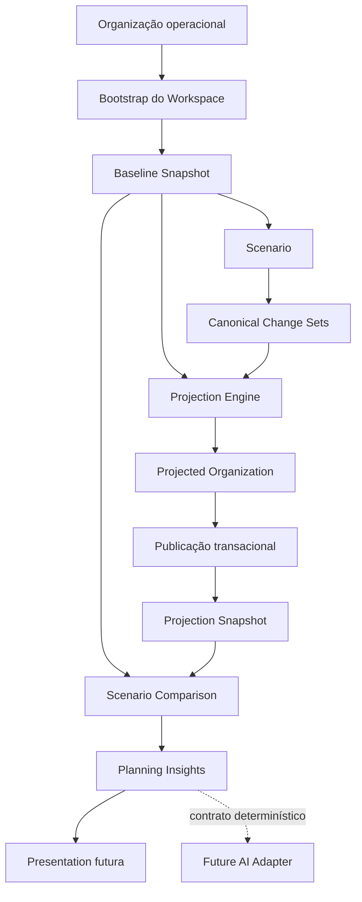
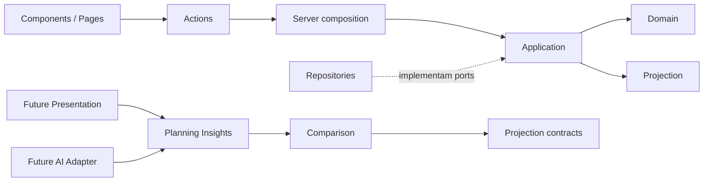

# Organization Planning — Arquitetura

## Visão geral

Organization Planning representa a evolução planejada de uma organização sem
alterar o estado operacional durante a análise. Um Workspace nasce com um
Baseline Snapshot, cenários acumulam Change Sets canônicos e a Projection Engine
produz novos estados organizacionais imutáveis. Comparison e Planning Insights
consomem esses estados de forma determinística.

O módulo vive em
`apps/web/src/features/organization-planning` e segue a arquitetura feature-first.

## Fluxo completo

## Módulos e responsabilidades

| Módulo | Responsabilidade | Não conhece |
| --- | --- | --- |
| `domain/` | Entidades, invariantes, transições e eventos | React, Supabase, repositories |
| `application/` | Orquestra casos de uso por handlers e ports | UI e infraestrutura concreta |
| `projection/` | Aplica Change Sets em memória e produz organização projetada | Banco, RPC e React |
| `projection/comparison/` | Compara organizações ou snapshots já projetados | Projection Engine, banco e IA |
| `planning-insights/` | Interpreta `ScenarioComparisonResult` por regras determinísticas | Snapshots, banco, Projection Engine e IA |
| `repositories/` | Adapta persistência, RPCs e registros aos ports | Regras de domínio e UI |
| `server/` | Compõe handlers com adapters server-only | Componentes React |
| `actions/` | Valida a fronteira web, invoca handlers e revalida cache | Repositories concretos e regras de negócio |
| `components/` | Apresenta dados e inicia Actions | Engines, banco e regras de negócio |
| `queries/` | Expõe leituras server-side existentes | Escrita e regras de projeção |

Comparison está fisicamente sob `projection/` porque compartilha os contratos de
organização projetada, mas é uma etapa somente de leitura: ela não executa nem
depende da Projection Engine.

## Direção das dependências

Regras de dependência:

1. Domain não depende de Application, Services, repositories ou framework.
2. Application depende de ports; a composição server-only fornece adapters.
3. Projection opera somente com contratos e estado em memória.
4. Comparison recebe estados já projetados e nunca dispara projeção.
5. Planning Insights recebe exclusivamente `ScenarioComparisonResult`.
6. IA futura consome Insights; não substitui regras determinísticas.

## Estado e persistência

- O Baseline é a raiz imutável da linhagem de snapshots.
- Change Sets persistidos são a fonte canônica das mudanças do cenário.
- A organização projetada é persistida exatamente no Snapshot publicado.
- A publicação usa RPC PostgreSQL para manter cenário e Snapshot atômicos.
- Snapshots legados sem organização permanecem legíveis, mas não são uma base
  válida para nova publicação.

## APIs públicas

O barrel raiz `organization-planning/index.ts` expõe apenas operações de consumo,
contratos de domínio já públicos, Scenario Comparison e Planning Insights.
Actions, componentes e composição server-only possuem entradas próprias e não são
reexportados pelo barrel raiz.

Helpers de comparadores, calculators, regras, mappers e records permanecem
internos aos respectivos módulos.

## Imutabilidade e determinismo

- Snapshot e Change Sets de entrada não são mutados.
- Projection, Comparison e Planning Insights devolvem resultados congelados.
- Change Sets e diferenças são ordenados por critérios estáveis.
- IDs de warnings e recomendações são estáveis e independentes da mensagem.
- O mesmo input produz o mesmo output sem relógio implícito ou chamada externa.

## Pontos temporários conhecidos

- `SimplePlanningUnitOfWork` ainda representa apenas o ciclo lógico dos handlers
  que não foram migrados para RPC transacional.
- A UI atual cobre criação e listagem; Presentation específica para Comparison e
  Insights é uma evolução posterior.
- Company e Workspace são validados na fronteira que ainda possui esses dados;
  `ScenarioComparisonResult` não repete metadados de escopo.
