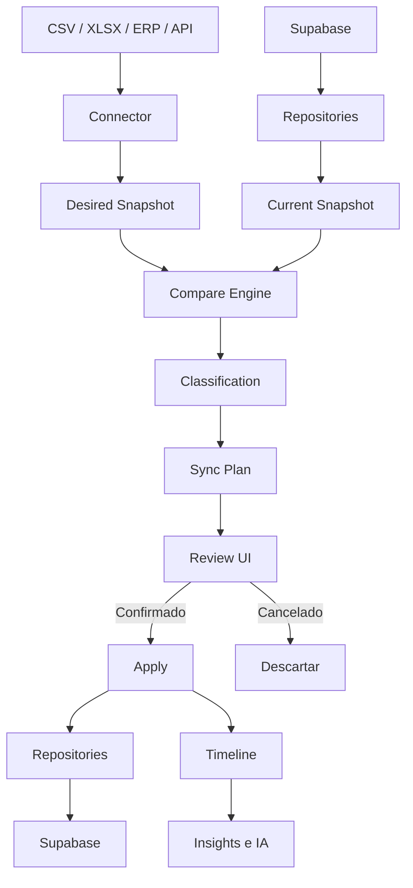

# Diagrama — Organization Sync Engine

```mermaid
flowchart TD
    A[CSV / XLSX / ERP / API] --> B[Connector]
    B --> C[Desired Snapshot]
    D[Supabase] --> E[Repositories]
    E --> F[Current Snapshot]
    C --> G[Compare Engine]
    F --> G
    G --> H[Classification]
    H --> I[Sync Plan]
    I --> J[Review UI]
    J -->|Confirmado| K[Apply]
    J -->|Cancelado| L[Descartar]
    K --> M[Repositories]
    M --> N[Supabase]
    K --> O[Timeline]
    O --> P[Insights e IA]
```
